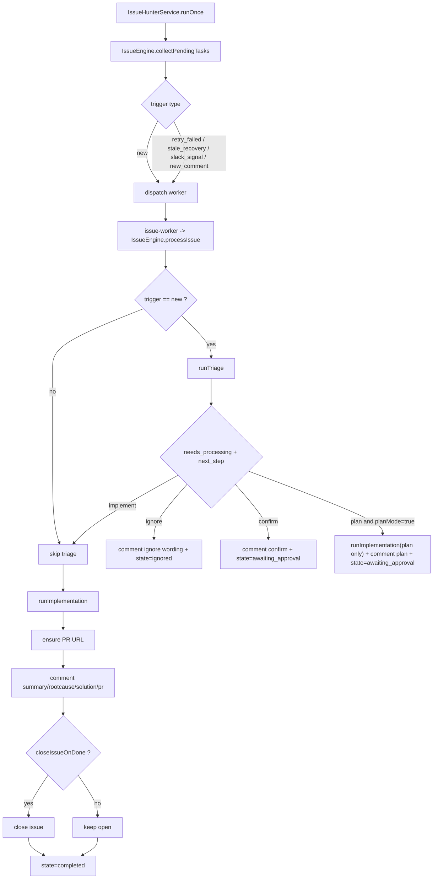
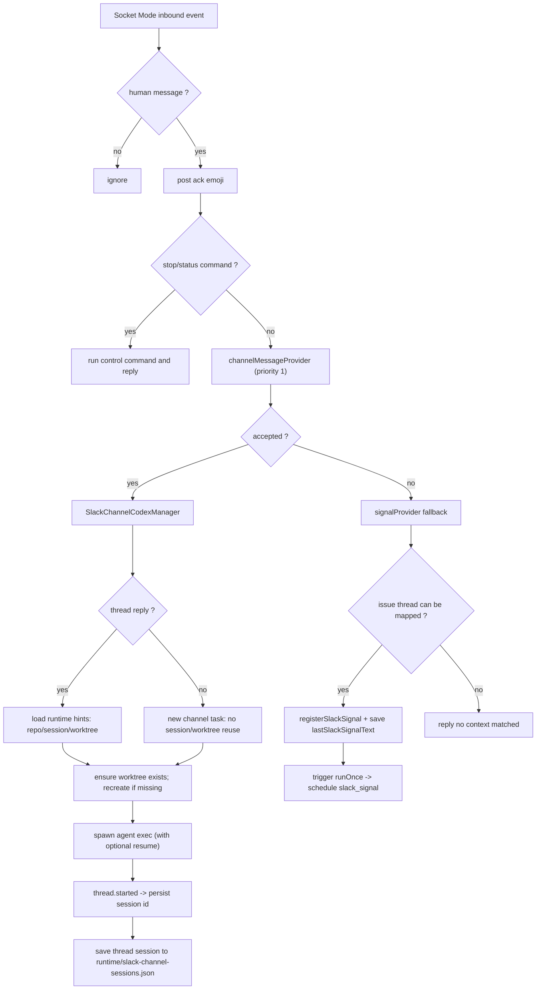

# GitHub Issue Hunter

一个面向本地仓库的 GitHub Issue 自动处理系统：
- 24x7 轮询仓库 Open Issue
- 自动 triage（是否需要处理）
- 需要处理时在隔离 `worktree` 中调用可配置 AI CLI（Codex / Claude）执行修复
- 自动回写 issue（Summary / RootCause / Solution / PR）
- 可选 Slack 集成（线程内持续跟进）
- 内置 Web UI（Issue Hunter / Board / Slack）

## 最新特性（新增）

- 24x7 运行状态持久化与自动恢复
  - 用户点击“启动 24x7”后，状态会写入 `serviceState.running=true`
  - 服务重启时自动读取该状态并恢复运行，无需手动再次点击启动
- Plan 模式（默认开启）
  - 仅在“GitHub 新 issue 首次进入”且 triage 判断“需要处理”时，先输出详细设计与实现方案并回写到 issue
  - 系统进入 `awaiting_approval` 状态，等待用户 approve
  - 只有收到 approve 后，才进入实际实现阶段
- 会话编排调整（电话机模式）
  - 只有 GitHub 新 issue 首次进入会走 triage
  - 同一 issue 下后续 comment 不再 triage，直接进入实现阶段
  - Slack 消息优先走 Channel 直连链路；无法路由时才回落到 issue signal 链路
  - Board 中会展示“处理中（含 awaiting_approval）”与“已完成”
- AI Backend 自动探测与切换
  - 自动探测本机 `codex` 与 `claude` 可执行文件
  - 仅一个可用则默认该后端；两个都可用默认 `codex`
  - 可在 UI 全局配置中手动切换后端
- Slack 消息批量合并
  - 线程进度更新会按时间窗口聚合，减少刷屏
  - 默认每 45 秒发送一批（可通过环境变量调整）
- Context 文件不再写入仓库
  - issue 的 `context.json` 统一写入工作目录下的 `artifacts`，避免误提交到业务仓库
- 稳定性增强（调度与连接）
  - 新增 `GET /api/health`，返回服务状态、worker 心跳、Slack Socket 连接状态与错误统计
  - worker 子进程增加心跳上报；超时会被主进程自动回收并标记可重试失败（`stale_recovery`）
  - Slack Socket Mode 重连后自动触发 catch-up `runOnce`，降低断连窗口漏扫风险
  - Slack Socket 事件增加去重缓存，避免重复事件导致重复触发
  - `gh api` 调用增加指数退避重试，缓解短暂网络抖动（如 `connection reset by peer`）
  - Slack 频道 thread 会话绑定 `issueKey`，拒绝跨 issue 复用，避免上下文串线
  - 若 thread 绑定的 worktree 已丢失，会自动重建后继续执行

## 界面预览

### 1) 主界面与服务控制


### 2) 仓库配置（工作目录、wording、并发）


### 3) Issue Board（处理中 / 已完成）


## 核心能力

- 多仓库管理
  - 配置本地仓库路径后，自动识别 `owner/repo`
  - 每仓库独立并发控制
- 自动处理流程
  - 发现新 issue（首次）-> 回复 triage wording -> AI triage 判断
  - triage 判断不处理 -> 回复 ignore wording
  - triage 判断处理
    - Plan 模式开启：先回复 implement wording + 设计方案，等待 approve 后实现
    - Plan 模式关闭：直接回复 implement wording 并进入实现
  - 同一 issue 后续 comment：直接转发给同一 Codex session（不再重新 triage）
- 隔离执行
  - 所有代码修改都在 `git worktree` 中完成，避免互相污染
- PR 与回写
  - 处理完成后回写 `Summary / RootCause / Solution / PR`
  - 自动建 PR 时可配置 issue 关联策略：`Closes/Fixes/Resolves`（默认）或 `Refs`
- 看板追踪
  - UI 卡片化展示处理中与已完成 issue
  - 支持查看原始问题、讨论过程、解决方案与 PR 链接
- Slack（可选）
  - 绑定 channel 后，在同一 thread 内同步进度
  - 支持 Socket Mode
  - 线程消息批量聚合，默认降低高频推送

## 当前处理 Workflow（与代码实现对齐）



### Slack 路由与 Session 复用编排图



### 哪些 comment 会交给 AI agent 处理

1. GitHub 新 issue 首次触发（`triggerType = new`）会先 triage，再按结果进入 ignore/confirm/plan/implement。  
   代码：`src/core/issue-engine.ts`（`shouldRunTriage = input.triggerType === "new"`）
2. GitHub 后续评论不会默认全量触发；仅在记录状态为 `completed/ignored/failed/awaiting_approval` 且出现“新的外部评论 ID”时，触发 `new_comment`。  
   代码：`src/core/issue-engine.ts`（`collectPendingTasks` 内 `retryNewComment` 分支）
3. `new_comment / slack_signal / retry_failed / stale_recovery` 都跳过 triage，直接进入实现阶段。  
   代码：`src/core/issue-engine.ts`（`shouldRunTriage === false` 分支）
4. Slack 消息先走 `channelMessageProvider`；被接收时直接进入 `SlackChannelCodexManager`（频道主流新消息新建会话，thread 回复复用会话）。  
   代码：`src/chat/vercel-chat-bridge.ts`（`channelMessageProvider` 优先于 `signalProvider`）
5. 只有当 `channelMessageProvider` 未接收时，才回落到 `signalProvider(registerSlackSignal)`，并在下一轮 `runOnce` 以 `slack_signal` 触发 issue 流程。  
   代码：`src/core/issue-hunter-service.ts`（`registerSlackSignal` + `runOnceSafe`）

### Hardcode 正则/字符串匹配（当前实现）

| 模块 | 用途 | 规则（正则/字符串） |
|---|---|---|
| `src/chat/vercel-chat-bridge.ts` | stop 命令 | `/(^|\s)(stop\|cancel\|abort\|terminate)(\s\|$)/i` + `"停止"`, `"中止"`, `"终止"` |
| `src/chat/vercel-chat-bridge.ts` | status 命令 | `/^\/?(status\|状态\|服务状态\|运行状态)([?!？！。]?)$/`（会先去掉 `<@...>` mention） |
| `src/chat/vercel-chat-bridge.ts` | Slack事件类型 | `type === "message"` 或 `type === "app_mention"`；`subtype` 白名单/黑名单（如 `message_replied`, `thread_broadcast`, `bot_message`） |
| `src/chat/vercel-chat-bridge.ts` | 人类消息过滤 | 必须有 `client_msg_id`，且过滤 bot/user=self |
| `src/core/issue-engine.ts` | 新评论触发重处理 | `latestExternalCommentId > lastExternalCommentId` |
| `src/core/issue-engine.ts` | triage `next_step` 映射 | implement：`implement/execute/process/进入开发/开始实现/处理`；plan：`plan/design/update/update_plan/await_approval/awaiting_approval/等待审批/设计/更新方案/先出方案`；confirm：`confirm/await_confirm/awaiting_confirm/等待确认/待确认`；ignore：`ignore/skip/no_action/不处理/暂不处理/忽略` |
| `src/core/issue-engine.ts` | bot评论识别/幂等 | marker: `<!-- issue-hunter:auto -->`；idempotency正则：`/<!--\s*issue-hunter:idempotency:([^\s]+)\s*-->/i` |
| `src/core/issue-engine.ts` | issue/评论图片提取 | Markdown图：`/!\[[^\]]*\]\(([^)\s]+)\)/g`；HTML图：`/]*src=["']([^"']+)["'][^>]*>/gi` |
| `src/core/issue-hunter-service.ts` | Slack线程反查issue | URL正则：`/https?:\/\/github\.com\/([^/\s>]+)\/([^/\s>]+)\/issues\/(\d+)/i`；文本号正则：`/\bissue\s*#(\d+)\b/i` |
| `src/core/codex-runner.ts` | triage结果解析 | JSON code block：`/```json\s*([\s\S]*?)\s*```/i`；`needs_processing`/`决策`/`原因`/`下一步`相关正则匹配 |
| `src/core/codex-runner.ts` | PR链接提取 | `/https?:\/\/github\.com\/[^\s)]+\/pull\/\d+/i` |
| `src/core/config-store.ts` | triage命令自动迁移 | 检测旧两行模板字符串：`"exactly two lines" + "决策: 是 或 决策: 否" + "原因: <一句话>" + 不含 "下一步"` |

## 技术栈

- Node.js + TypeScript
- Express
- GitHub CLI (`gh`)
- Slack SDK / Chat SDK

## 前置要求

1. Node.js 18+
2. Git
3. GitHub CLI（已登录）

```bash
gh auth status
# 若未登录
gh auth login
```

## 启动

```bash
npm install
npm run dev
```

默认地址：`http://127.0.0.1:8787`

## 一键安装与启动

### 方式 A：npm（一键）

在项目目录执行：

```bash
npm run quickstart
```

该命令会自动执行：安装依赖 -> 构建 -> 后台启动服务。

### 方式 B：curl（一键）

```bash
curl -fsSL https://raw.githubusercontent.com/wangqianqianjun/github-issue-hunter/main/scripts/install.sh | bash
```

可选参数（示例）：

```bash
curl -fsSL https://raw.githubusercontent.com/wangqianqianjun/github-issue-hunter/main/scripts/install.sh | bash -s -- --dir "$HOME/github-issue-hunter" --no-start
```

安装脚本默认行为：
- 安装目录：`$HOME/.github-issue-hunter`
- 自动拉取最新代码并安装依赖
- 自动构建并后台启动

后台服务管理：

```bash
npm run service:status
npm run service:restart
npm run service:stop
```

## 基本使用

1. 打开 UI，先配置全局参数（轮询间隔、并发、工作目录、Plan 模式）
2. 在仓库配置中填写本地路径并保存（可选设置 PR issue 关联策略：自动关闭或仅关联）
3. （可选）在 Slack Tab 完成 Bot/App Token 配置并绑定频道
4. 启动 `24x7`，或先点“立即轮询一次”验证流程
5. 24x7 启动状态会自动持久化；重启服务后会自动恢复到上次运行状态

## 运行数据目录

- 运行态配置：`state/config.json`
- 运行时数据：`state/runtime/`
- issue 上下文与产物：`<工作目录>/artifacts/`
  - 示例：`<工作目录>/artifacts/<repoId>/issue-180/context.json`
  - 不会再写入业务仓库的 `.issue-hunter/` 目录

## 安全说明

仓库已通过 `.gitignore` 默认排除敏感与运行态文件（如 Slack/GitHub 凭据、runtime 日志、临时产物），避免误提交。

如果你新增了凭据文件，请同步更新 `.gitignore`。

## License

本项目基于 [MIT License](./LICENSE) 开源。

## 常用命令

```bash
npm test
npm run build
npm run dev
```
