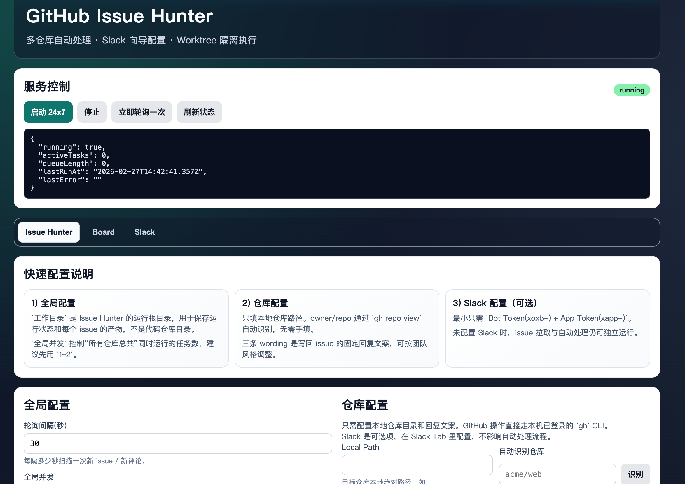
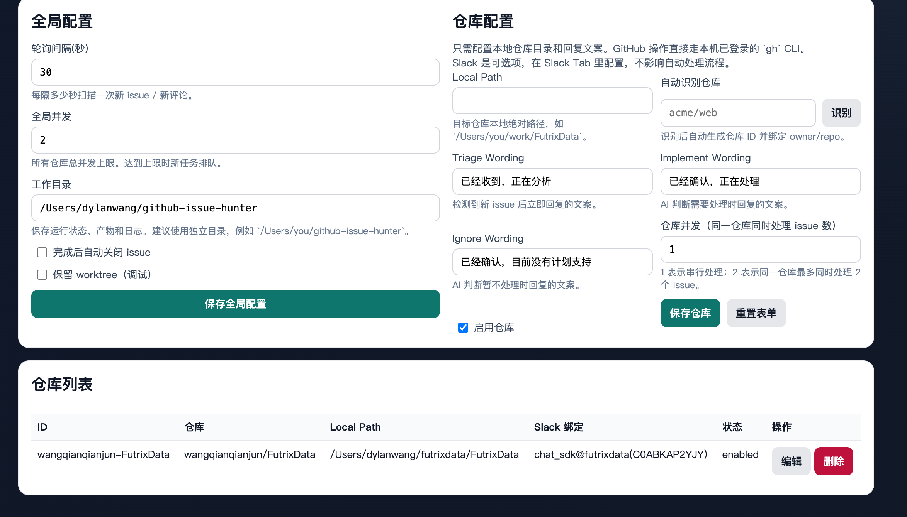
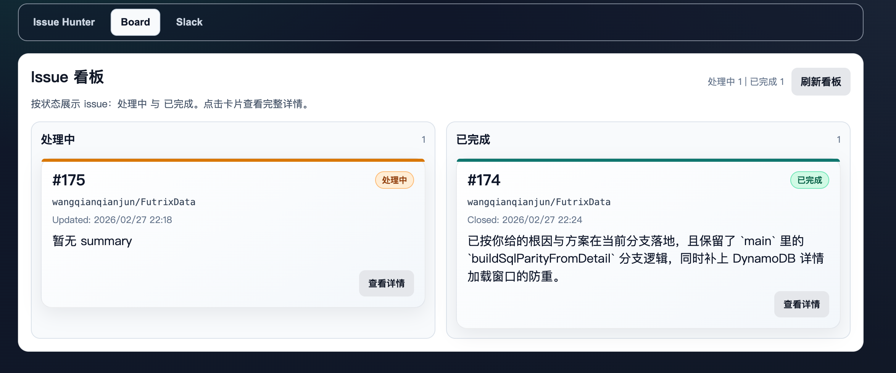
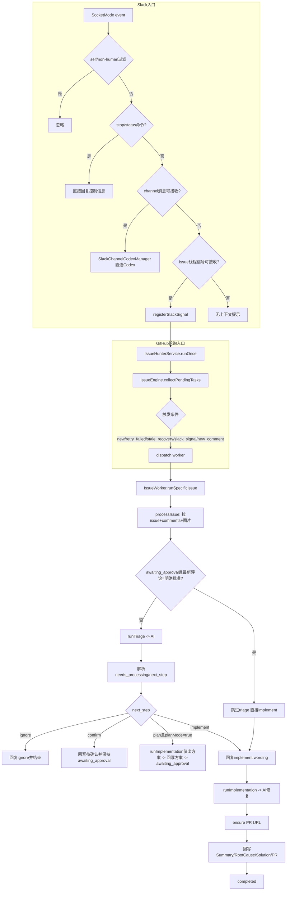

# GitHub Issue Hunter

一个面向本地仓库的 GitHub Issue 自动处理系统：
- 24x7 轮询仓库 Open Issue
- 自动 triage（是否需要处理）
- 需要处理时在隔离 `worktree` 中调用 Codex 执行修复
- 自动回写 issue（Summary / RootCause / Solution / PR）
- 可选 Slack 集成（线程内持续跟进）
- 内置 Web UI（Issue Hunter / Board / Slack）

## 最新特性（新增）

- Plan 模式（默认开启）
  - 当 triage 判断“需要处理”时，先输出详细设计与实现方案并回写到 issue
  - 系统进入 `awaiting_approval` 状态，等待用户 approve
  - 只有收到 approve 后，才进入实际实现阶段
- 审批驱动实现
  - 支持在 issue 评论中使用 `approve / approved / 同意 / 通过 / lgtm / go ahead` 等指令触发实现
  - Board 中会展示“处理中（含 awaiting_approval）”与“已完成”
- Slack 消息批量合并
  - 线程进度更新会按时间窗口聚合，减少刷屏
  - 默认每 45 秒发送一批（可通过环境变量调整）
- Context 文件不再写入仓库
  - issue 的 `context.json` 统一写入工作目录下的 `artifacts`，避免误提交到业务仓库

## 界面预览

### 1) 主界面与服务控制


### 2) 仓库配置（工作目录、wording、并发）


### 3) Issue Board（处理中 / 已完成）


## 核心能力

- 多仓库管理
  - 配置本地仓库路径后，自动识别 `owner/repo`
  - 每仓库独立并发控制
- 自动处理流程
  - 发现新 issue -> 回复 triage wording
  - AI 判断不处理 -> 回复 ignore wording
  - AI 判断处理
    - Plan 模式开启：先回复 implement wording + 设计方案，等待 approve 后实现
    - Plan 模式关闭：直接回复 implement wording 并进入实现
- 隔离执行
  - 所有代码修改都在 `git worktree` 中完成，避免互相污染
- PR 与回写
  - 处理完成后回写 `Summary / RootCause / Solution / PR`
- 看板追踪
  - UI 卡片化展示处理中与已完成 issue
  - 支持查看原始问题、讨论过程、解决方案与 PR 链接
- Slack（可选）
  - 绑定 channel 后，在同一 thread 内同步进度
  - 支持 Socket Mode
  - 线程消息批量聚合，默认降低高频推送

## 当前处理 Workflow（含硬编码匹配点）



### 哪些 comment 会交给 AI agent 处理

1. GitHub issue 正文与评论会进入 `context.json`，用于 triage/implement。  
   代码：`src/core/issue-engine.ts`（`prepareWorkspace` 前后）
2. `new_comment` 触发后默认先交给 AI triage（由 AI 决定下一阶段）。  
   代码：`src/core/issue-engine.ts`（`runTriage` 分支）
3. `awaiting_approval` 阶段若最新评论是“明确批准短评论”，跳过 triage 直接 implement。  
   代码：`src/core/issue-engine.ts`（`isExplicitApprovalComment`）
4. Slack issue-thread 消息先写入 `lastSlackSignalText`，再由 issue 主流程调度 AI。  
   代码：`src/core/issue-hunter-service.ts`（`registerSlackSignal`）
5. Slack channel/thread 消息走 `SlackChannelCodexManager`，直接拉起/续接 codex 会话。  
   代码：`src/core/slack-channel-codex-manager.ts`

### Hardcode 正则/字符串匹配（当前实现）

| 模块 | 用途 | 规则（正则/字符串） |
|---|---|---|
| `src/chat/vercel-chat-bridge.ts` | stop 命令 | `/(^|\s)(stop\|cancel\|abort\|terminate)(\s\|$)/i` + `"停止"`, `"中止"`, `"终止"` |
| `src/chat/vercel-chat-bridge.ts` | status 命令 | `text.includes("status")` |
| `src/chat/vercel-chat-bridge.ts` | Slack事件类型 | `type === "message"` 或 `type === "app_mention"`；`subtype` 白名单/黑名单（如 `message_replied`, `thread_broadcast`, `bot_message`） |
| `src/chat/vercel-chat-bridge.ts` | 人类消息过滤 | 必须有 `client_msg_id`，且过滤 bot/user=self |
| `src/core/issue-engine.ts` | 新评论触发重处理 | `latestExternalCommentId > lastExternalCommentId` |
| `src/core/issue-engine.ts` | 明确批准直达实现 | 长度 `<=120`；拒绝 `#` 标题/代码块；负向词：`not approve`, `do not approve`, `disapprove`, `reject`, `wait`, `hold`, `不同意`, `不通过`, `不要开始`, `先别做`, `暂不处理`；正向英文：`approve`, `approved`, `lgtm`；正向中文：`同意`, `通过`, `批准`, `可以开始`, `开始实现`, `按方案实现`, `按方案处理`, `继续实现` |
| `src/core/issue-engine.ts` | triage `next_step` 映射 | implement：`implement/execute/process/进入开发/开始实现/处理`；plan：`plan/design/update/update_plan/await_approval/awaiting_approval/等待审批/设计/更新方案/先出方案`；confirm：`confirm/await_confirm/awaiting_confirm/等待确认/待确认`；ignore：`ignore/skip/no_action/不处理/暂不处理/忽略` |
| `src/core/issue-engine.ts` | bot评论识别/幂等 | marker: `<!-- issue-hunter:auto -->`；idempotency正则：`/<!--\s*issue-hunter:idempotency:([^\s]+)\s*-->/i` |
| `src/core/issue-engine.ts` | issue/评论图片提取 | Markdown图：`/!\[[^\]]*\]\(([^)\s]+)\)/g`；HTML图：`/]*src=["']([^"']+)["'][^>]*>/gi` |
| `src/core/issue-hunter-service.ts` | Slack线程反查issue | URL正则：`/https?:\/\/github\.com\/([^/\s>]+)\/([^/\s>]+)\/issues\/(\d+)/i`；文本号正则：`/\bissue\s*#(\d+)\b/i` |
| `src/core/codex-runner.ts` | triage结果解析 | JSON code block：`/```json\s*([\s\S]*?)\s*```/i`；`needs_processing`/`决策`/`原因`/`下一步`相关正则匹配 |
| `src/core/codex-runner.ts` | PR链接提取 | `/https?:\/\/github\.com\/[^\s)]+\/pull\/\d+/i` |
| `src/core/config-store.ts` | triage命令自动迁移 | 检测旧两行模板字符串：`"exactly two lines" + "决策: 是 或 决策: 否" + "原因: <一句话>" + 不含 "下一步"` |

## 技术栈

- Node.js + TypeScript
- Express
- GitHub CLI (`gh`)
- Slack SDK / Chat SDK

## 前置要求

1. Node.js 18+
2. Git
3. GitHub CLI（已登录）

```bash
gh auth status
# 若未登录
gh auth login
```

## 启动

```bash
npm install
npm run dev
```

默认地址：`http://127.0.0.1:8787`

## 一键安装与启动

### 方式 A：npm（一键）

在项目目录执行：

```bash
npm run quickstart
```

该命令会自动执行：安装依赖 -> 构建 -> 后台启动服务。

### 方式 B：curl（一键）

```bash
curl -fsSL https://raw.githubusercontent.com/wangqianqianjun/github-issue-hunter/main/scripts/install.sh | bash
```

可选参数（示例）：

```bash
curl -fsSL https://raw.githubusercontent.com/wangqianqianjun/github-issue-hunter/main/scripts/install.sh | bash -s -- --dir "$HOME/github-issue-hunter" --no-start
```

安装脚本默认行为：
- 安装目录：`$HOME/.github-issue-hunter`
- 自动拉取最新代码并安装依赖
- 自动构建并后台启动

后台服务管理：

```bash
npm run service:status
npm run service:restart
npm run service:stop
```

## 基本使用

1. 打开 UI，先配置全局参数（轮询间隔、并发、工作目录、Plan 模式）
2. 在仓库配置中填写本地路径并保存
3. （可选）在 Slack Tab 完成 Bot/App Token 配置并绑定频道
4. 启动 `24x7`，或先点“立即轮询一次”验证流程

## 运行数据目录

- 运行态配置：`state/config.json`
- 运行时数据：`state/runtime/`
- issue 上下文与产物：`<工作目录>/artifacts/`
  - 示例：`<工作目录>/artifacts/<repoId>/issue-180/context.json`
  - 不会再写入业务仓库的 `.issue-hunter/` 目录

## 安全说明

仓库已通过 `.gitignore` 默认排除敏感与运行态文件（如 Slack/GitHub 凭据、runtime 日志、临时产物），避免误提交。

如果你新增了凭据文件，请同步更新 `.gitignore`。

## 常用命令

```bash
npm test
npm run build
npm run dev
```
